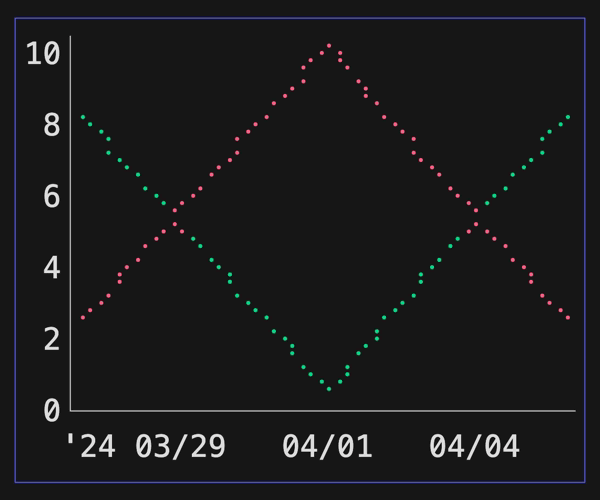
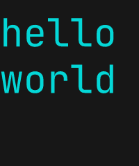
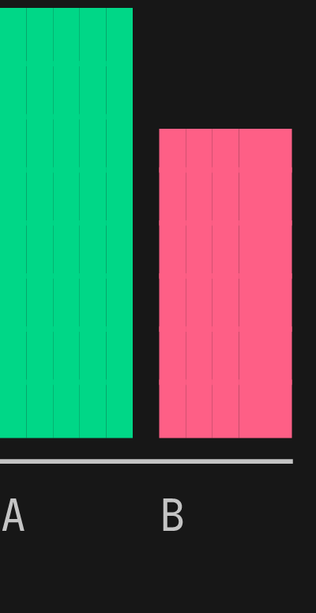
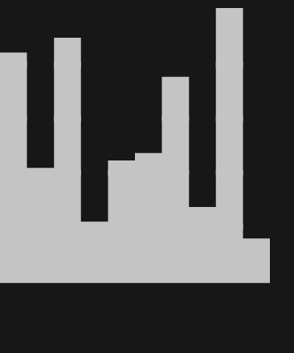

# ntcharts - Nimble Terminal Charts

<p>
    <a href="https://github.com/NimbleMarkets/ntcharts/tags"></a>
    <a href="https://pkg.go.dev/github.com/NimbleMarkets/ntcharts?tab=doc"></a>
    <a href="https://github.com/NimbleMarkets/ntcharts/blob/main/CODE_OF_CONDUCT.md"></a>
</p>

`ntcharts` is a Golang Terminal Charting library for the Bubble Tea Framework and other TUIs.

We supply many chart types within the glory of your terminal!  

| Type | Description |
| :-------- | :----- |
| [Canvas](./examples/README.md#canvas) | A 2D grid to plot arbitrary runes, with [LipGloss](https://github.com/charmbracelet/lipgloss) for styling and [BubbleZone](https://github.com/lrstanley/bubblezone) for mousing.  It is the foundation for all the following charts. |
| [Bar Chart](./examples/README.md#bar-chart) | Displays values as either horizontal rows or vertical columns. |
| [Line Chart](./examples/README.md#lines) | Displays (X,Y) data points onto a 2D grid in various types of charts. |
| [Scatter Chart](./examples/README.md#scatter) | Plots abitrary runes onto (X,Y) coordinates. |
| [Streamline Chart](./examples/README.md#streaming) | Displays a continuous a line moving across the Canvas from the right side to the left side. |
| [Time Series Chart](./examples/README.md#time-series) | Displays lines with values on the Y axis and time values on the X axis. |
| [Waveline Chart](./examples/README.md#wave-line) | A line chart that connects points in a wave pattern. |
| [Sparkline](./examples/README.md#sparkline) | A small, simple visual of data chart for quick understanding. |

## Quickstart Tutorial

This [tutorial](./examples/quickstart/README.md) creates a simple [Time Series Chart](./examples/README.md#time-series) with two data sets utilizing the Bubble Tea framework, Lip Gloss for styling and BubbleZone for mouse support.

<a href="./examples/quickstart/README.md" alt="quickstart readme"></a>

## Usage

See the [`examples` folder](./examples/README.md) for code samples and visuals of each type.

#### Canvas

```go
package main

import (
    "fmt"
    "github.com/NimbleMarkets/ntcharts/canvas"
    "github.com/charmbracelet/lipgloss"
)

func main() {
    c := canvas.New(5, 2)
    c.SetLinesWithStyle(
        []string{"hello", "world"},
        lipgloss.NewStyle().Foreground(lipgloss.Color("6"))) // cyan

    fmt.Println(c.View())
}
```

This example produces the following canvas with Lip Gloss foreground color:



#### Bar Chart

```go
package main

import (
    "fmt"
    "github.com/NimbleMarkets/ntcharts/barchart"
    "github.com/charmbracelet/lipgloss"
)

func main() {
    d1 := barchart.BarData{
        Label: "A",
        Values: []barchart.BarValue{
            {"Item1", 21.2, lipgloss.NewStyle().Foreground(lipgloss.Color("10"))}}, // green
    }
    d2 := barchart.BarData{
        Label: "B",
        Values: []barchart.BarValue{
            {"Item1", 15.2, lipgloss.NewStyle().Foreground(lipgloss.Color("9"))}}, // red
    }

    bc := barchart.New(11, 10)
    bc.PushAll([]barchart.BarData{d1, d2})
    bc.Draw()

    fmt.Println(bc.View())
}
```

This example produces the following bar chart with green and red bars:



#### Streamline Chart
```go
package main

import (
    "fmt"
    "github.com/NimbleMarkets/ntcharts/linechart/streamlinechart"
)

func main() {
    slc := streamlinechart.New(13, 10)
    for _, v := range []float64{4, 6, 8, 10, 8, 6, 4, 2, 0, 2, 4} {
        slc.Push(v)
    }
    slc.Draw()

    fmt.Println(slc.View())
}
```

This example produces the following streamline chart:
```
  │  ╭╮      
 8│  ││      
  │ ╭╯╰╮     
 6│ │  │     
  │╭╯  ╰╮    
 4├╯    ╰╮  ╭
  │      │  │
 2│      ╰╮╭╯
  │       ││ 
 0│       ╰╯ 
```

#### Time Series Chart
```go
package main

import (
    "fmt"
    "time"
    "github.com/NimbleMarkets/ntcharts/linechart/timeserieslinechart"
)

func main() {
    tslc := timeserieslinechart.New(41, 10)
    for i, v := range []float64{0, 4, 8, 10, 8, 4, 0, -4, -8, -10, -8, -4, 0} {
        date := time.Now().Add(time.Hour * time.Duration(24*i))
        tslc.Push(timeserieslinechart.TimePoint{date, v})
    }
    tslc.DrawBraille()

    fmt.Println(tslc.View())
}
```

This example produces the following time series chart using braille runes starting with today's date:
```
 10│      ⣀⠤⠒⠉⠒⠤⡀                        
   │    ⡠⠊      ⠈⠢⡀                      
  5│  ⡠⠊          ⠈⠢⡀                    
   │⡠⠊              ⠈⠑⢄                 ⢀
  0│                   ⠑⡄              ⡔⠁
   │                    ⠈⠢⡀          ⡠⠊  
 -5│                      ⠈⠢⡀      ⡠⠊    
   │                        ⠈⠑⠢⢄⡠⠔⠊      
-10└─────────────────────────────────────
   '24 03/27   03/31   04/03   04/05     
```

#### Waveline Chart
```go
package main

import (
    "fmt"
    "github.com/NimbleMarkets/ntcharts/canvas"
    "github.com/NimbleMarkets/ntcharts/linechart/wavelinechart"
)

func main() {
    wlc := wavelinechart.New(12, 10, wavelinechart.WithYRange(-3, 3))
    wlc.Plot(canvas.Float64Point{1.0, 2.0})
    wlc.Plot(canvas.Float64Point{3.0, -2.0})
    wlc.Plot(canvas.Float64Point{5.0, 2.0})
    wlc.Plot(canvas.Float64Point{7.0, -2.0})
    wlc.Plot(canvas.Float64Point{9.0, 2.0})
    wlc.Draw()

    fmt.Println(wlc.View())
}
```

This example produces the following waveline chart:
```
 3│         
  │╭╮  ╭╮  ╭
 2│││  ││  │
  │││  ││  │
 0├╯╰╮╭╯╰╮╭╯
  │  ││  ││ 
-2│  ││  ││ 
  │  ╰╯  ╰╯ 
-3└─────────
  0 2 4 6    
```

#### Sparkline

```go
package main

import (
    "fmt"
    "github.com/NimbleMarkets/ntcharts/sparkline"
)

func main() {
    sl := sparkline.New(10, 5)
    sl.PushAll([]float64{7.81, 3.82, 8.39, 2.06, 4.19, 4.34, 6.83, 2.51, 9.21, 1.3})
    sl.Draw()

    fmt.Println(sl.View())
}
```

This example produces the following sparkline:




## Open Collaboration

We welcome contributions and feedback.  Please adhere to our [Code of Conduct](./CODE_OF_CONDUCT.md) when engaging our community.

 * [GitHub Issues](https://github.com/NimbleMarkets/ntcharts/issues)
 * [GitHub Pull Requests](https://github.com/NimbleMarkets/ntcharts/pulls)

## Acknowledgements

Thanks to [Charm.sh](https://charm.sh) for making the command line glamorous and sharing [Bubble Tea](https://github.com/charmbracelet/bubbletea) and [Lip Gloss](https://github.com/charmbracelet/lipgloss) and more.  Thanks to [BubbleZone](https://github.com/lrstanley/bubblezone) for bringing the mouse support :mouse:.

Thanks also to [asciigraph](https://github.com/guptarohit/asciigraph), [ratatui](https://docs.rs/ratatui/latest/ratatui/index.html), and [termdash](https://github.com/mum4k/termdash) for inspiration.

## License

Released under the [MIT License](https://en.wikipedia.org/wiki/MIT_License), see [LICENSE.txt](./LICENSE.txt).

Copyright (c) 2024 [Neomantra Corp](https://www.neomantra.com).   

----
Made with :heart: and :fire: by the team behind [Nimble.Markets](https://nimble.markets).
