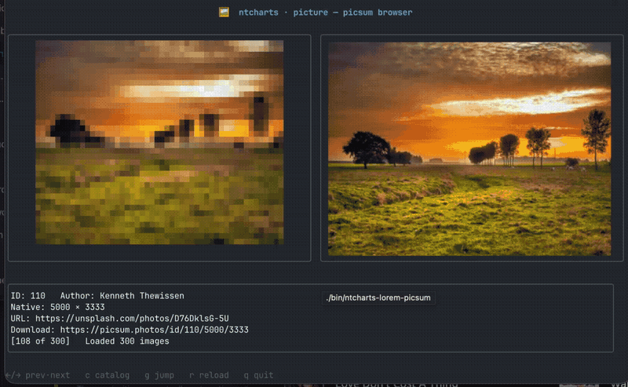

# ntcharts-lorem-picsum

`ntcharts-lorem-picsum` is a sortable, filterable browser over the [Lorem Picsum](https://picsum.photos/) catalog. Pick an image from the table and it renders side-by-side: half-block glyphs on the left (works in any terminal), full Kitty graphics on the right (requires a Kitty-graphics-capable terminal such as Kitty, Ghostty, or WezTerm).

It exercises the [`pictureurl`](../../picture/pictureurl) package end-to-end — async URL fetch, LRU image cache, error overlays, and the `picture.Model` Glyph/Kitty toggle.

[(source)](./main.go)


```
./bin/ntcharts-lorem-picsum
```

Keys:

| Key | Action |
| :--- | :--- |
| `←` / `h`, `→` / `l` | Previous / next image |
| `c` | Open catalog browser (then `/` to filter, `s` to cycle sort, `enter` to select, `esc` to close) |
| `g` | Jump to a numeric ID (type digits, then `enter`; `esc` to cancel) |
| `r` | Reload the current image (or retry catalog if it failed to load) |
| `q`, `ctrl+c` | Quit |
