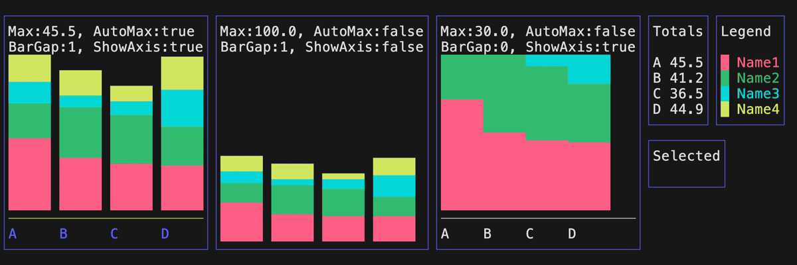

# Examples

## Quickstart

This [tutorial](quickstart/README.md) creates a simple [Time Series Chart](#time-series) with two data sets utilizing the Bubble Tea framework, Lip Gloss for styling and BubbleZone for mouse support.

<a href="quickstart/main.go" alt="quickstart example">(source)</a> 

## Canvas

A Canvas provides a 2D grid to plot arbitrary runes supporting [charmbraclet/lipgloss](https://github.com/charmbracelet/lipgloss) styles and uses [lrstanley/bubblezone](https://github.com/lrstanley/bubblezone) for mouse support.

<a href="canvas/logo/main.go" alt="logo canvas example">(source)</a> 

## Graphing

There are various graphing functions for drawing runes onto the Canvas.

### Braille

<a href="graph/braille/main.go" alt="braille graph example">(source)</a> 

### Circles

<a href="graph/circles/main.go" alt="circles graph example">(source)</a> 

### Columns

<a href="graph/columns/main.go" alt="columns graph example">(source)</a> 

### Lines

<a href="graph/lines/main.go" alt="lines graph example">(source)</a> 

### Rows

<a href="graph/rows/main.go" alt="rows graph example">(source)</a> 

## Bar Chart

Barcharts displays values as either horizontal rows or vertical columns.

### Rows

<a href="barchart/horizontal/main.go" alt="horizontal barchart example">(source)</a> 

### Columns

<a href="barchart/vertical/main.go" alt="vertical barchart example">(source)</a> 

## Line Chart

Linecharts displays (X,Y) data points onto a 2D grid in various types of charts.

### Circles

Circles can be displayed with a given point and radius.

<a href="linechart/circles/main.go" alt="circles linechart example">(source)</a> 

### Lines

Lines can be displayed between two points.

<a href="linechart/lines/main.go" alt="lines linechart example">(source)</a> 

### Scatter

Scatter charts can be created by plotting abitrary runes onto (X,Y) coordinates.

<a href="linechart/scatter/main.go" alt="scatter linechart example">(source)</a> 

### Streaming

Streaming charts display a continuous a line moving across the Canvas from the right side to the left side.

<a href="linechart/streaming/main.go" alt="streaming linechart example">(source)</a> 

### Time Series

Time series charts have values on the Y axis and time values on the X axis.

<a href="linechart/timeseries/main.go" alt="timeseries linechart example">(source)</a> 

### Wave Line

Wave line charts display a continuous a line going across the line chart.

<a href="linechart/wavelines/main.go" alt="wavelines linechart example">(source)</a> 

## Sparkline

Sparklines displays data moving across the Canvas from the right side to the left side.

<a href="sparkline/main.go" alt="sparkline example">(source)</a> 

