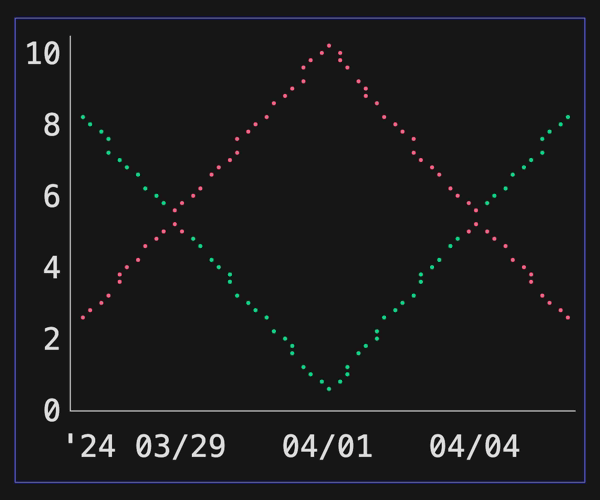

# Examples

## Quickstart

This [tutorial](quickstart/README.md) creates a simple [Time Series Chart](#time-series) with two data sets utilizing the Bubble Tea framework, Lip Gloss for styling and BubbleZone for mouse support.

[(source)](./quickstart/main.go) 

## Canvas

A Canvas provides a 2D grid to plot arbitrary runes supporting [Lip Gloss](https://github.com/charmbracelet/lipgloss) styles and uses [BubbleZone](https://github.com/lrstanley/bubblezone) for mouse support.

[(source)](./canvas/logo/main.go) 

## Graphing

There are various graphing functions for drawing runes onto the Canvas.

### Braille

[(source)](./graph/braille/main.go) 

### Candlesticks

[(source)](./graph/candlesticks/main.go) 

### Circles

[(source)](./graph/circles/main.go) 

### Columns

[(source)](./graph/columns/main.go) 

### Lines

[(source)](./graph/lines/main.go) 

### Rows

[(source)](./graph/rows/main.go) 

## Bar Chart

Barcharts displays values as either horizontal rows or vertical columns.

### Rows

[(source)](./barchart/horizontal/main.go) 

### Columns

[(source)](./barchart/vertical/main.go) 

## Line Chart

Linecharts displays (X,Y) data points onto a 2D grid in various types of charts.

### Circles

Circles can be displayed with a given point and radius.

[(source)](./linechart/circles/main.go) 

### Lines

Lines can be displayed between two points.

[(source)](./linechart/lines/main.go) 

### Scatter

Scatter charts can be created by plotting abitrary runes onto (X,Y) coordinates.

[(source)](./linechart/scatter/main.go) 

### Streaming

Streaming charts display a continuous a line moving across the Canvas from the right side to the left side.

[(source)](./linechart/streaming/main.go) 

### Time Series

Time series charts have values on the Y axis and time values on the X axis.

[(source)](./linechart/timeseries/main.go) 

### Wave Line

Wave line charts display a continuous a line going across the line chart.

[(source)](./linechart/wavelines/main.go) 

## Sparkline

Sparklines displays data moving across the Canvas from the right side to the left side.

[(source)](./sparkline/main.go) 

