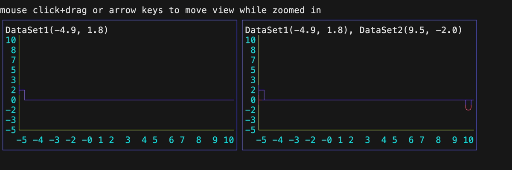

# Examples

## Canvas

A Canvas provides a 2D grid to plot arbitrary runes supporting [charmbraclet/lipgloss](https://github.com/charmbracelet/lipgloss) styles and uses [lrstanley/bubblezone](https://github.com/lrstanley/bubblezone) for mouse support.

## Graphing

There are various graphing functions for drawing runes onto the Canvas.

### Braille

### Circles

### Columns

### Lines

### Rows

## Bar Chart

Barcharts displays values as either horizontal rows or vertical columns.

### Rows

### Columns

## Line Chart

Linecharts displays (X,Y) data points onto a 2D grid in various types of charts.

### Circles

Circles can be displayed with a given point and radius.

### Lines

Lines can be displayed between two points.

### Scatter

Scatter charts can be created by plotting abitrary runes onto a (X,Y) coordinates.

### Streaming

Streaming charts display a continuous a line moving across the Canvas from the right side to the left side.

### Time Series

Time series charts have values on the Y axis and time values on the X axis.

### Wave Line

Wave line charts display a continuous a line going across the line chart.

## Sparkline

Sparklines displays data moving across the Canvas from the right side to the left side.

