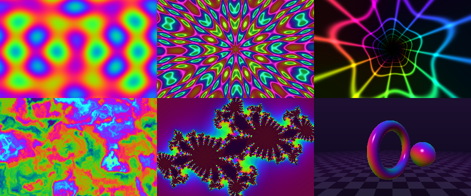

# GPU shader gallery

Six bundled WGSL shaders, rendered on your GPU and displayed inside the terminal
through `picture.Model` using PNG-direct transport. Browse with the arrow keys,
go fullscreen, and adjust the shader parameters and pixel density live.



Left to right: plasma, kaleidoscope, tunnel; flowing noise, Julia fractal,
raymarched chrome orbits. These shaders are included in this repository and need
no account, downloads or external textures at runtime.

## Run

No clone needed. This example is its own Go module, tagged with each ntcharts
release, so Go can fetch and run it directly (from the v2.3.0 release onward):

```sh
go run github.com/NimbleMarkets/ntcharts/v2/examples/shaders@latest
go run github.com/NimbleMarkets/ntcharts/v2/examples/shaders@latest -mosaic
```

From a checkout of the repository root:

```sh
task shaders
task shaders -- -fullscreen -slideshow=8s
```

The task builds `bin/ntcharts-shaders` and passes flags after `--` to the
viewer. `task build-ex-shaders` only builds it. Or run it directly with Go:

```sh
cd examples/shaders
go run .
```

Inside the checkout the Go workspace builds it against the working tree; the
module's own `go.mod` pins a released ntcharts so it also builds on its own.
The default example build includes this native example, and it is also in the
[live gallery](https://nimblemarkets.github.io/ntcharts/), where it runs on the
browser's WebGPU (Chrome, Edge, or Safari 26+). The gallery carries two builds
of it: the Go toolchain's, and a [TinyGo](https://tinygo.org) build of the same
source that is about a third of the size. Building the site needs TinyGo 0.42.0
or newer on `PATH` (or `TINYGO=/path/to/tinygo`); pass `-skip-tinygo` to
`cmd/wasm-build` to leave that demo out.
It requires Go 1.26+ and a supported hardware GPU/driver. It uses gogpu/wgpu's
pure-Go backends (no cgo, no native library to install): Metal on macOS, Vulkan
on Linux, Vulkan or DirectX 12 on Windows, with a CPU software fallback.
macOS/Metal is verified; Linux and Windows have not been visually verified for
this example.

A Kitty-capable terminal (such as Ghostty) provides the full image via PNG; other
terminals use glyph half-blocks. Under tmux, enable
`set -g allow-passthrough on`. Over SSH, GPU work runs on the remote host.

```sh
# A fullscreen slideshow for a demo or recording:
go run . -fullscreen -slideshow=8s

# Four shaders at once; browsing rotates which four are shown:
go run . -mosaic

# Read the WGSL beside the image:
go run . -source

# More source detail:
go run . -preset=orbits -density=24

# Capture all shaders on the GPU without a terminal:
go run . -snapshot=/tmp/shader-previews

# A bounded run with final statistics:
go run . -duration=10s -report=/tmp/shaders.json
```

## Controls

| Key | Action |
| --- | --- |
| Left / Right, h / l, 1–6 | Choose a shader |
| Space | Pause / resume |
| f or Ctrl+F | Fullscreen; f again or Esc returns |
| Up / Down or Tab | Select speed, scale, color or detail |
| [ / ] or − / + | Adjust the selected parameter |
| , / . | Decrease / increase pixel density |
| r | Restart the shader clock |
| a | Toggle the slideshow (8 seconds per shader) |
| m | Toggle a 2×2 mosaic: the selected shader plus the next three |
| s | Toggle the source pane: the shader's WGSL with syntax highlighting, then the shared prelude (single-shader mode, 110+ columns; the pane takes about half the width) |
| g | Toggle glyph rendering |
| q or Ctrl+C | Quit |

Pausing also pauses the slideshow. Browsing resets the shader clock and its
scale/detail defaults. Speed and palette offset persist. Small terminals hide
the sidebar; very small terminals show just the image.

The header shows rendering mode, application FPS, raster size,
**R** (GPU rendering plus readback), **E** (image preparation plus Kitty encoding),
and encoded APC size. Timings and FPS are smoothed. Application FPS measures
completion of the app's frame-submission cycle, **not terminal display refresh**;
Bubble Tea may batch output. APC size excludes placeholder cells and text.
`-report` counts encoded frames, not confirmed terminal presentations.

`-density` targets vertical pixels per terminal row, capped at native cell
resolution. The renderer preserves the cell aspect ratio and caps the raster at
2048×1536 and roughly 1.5 megapixels. The same raster feeds the GPU and the picture
widget, avoiding an extra resize. Lower the density with `,` to reduce PNG
encoding and terminal output costs. `-fps` is an application rate cap, not a guarantee. Default: 60 FPS, density 16.

## Implementation

The main loop keeps at most one GPU/render/encode/presentation cycle in flight;
input changes coalesce into the next frame. GPU calls, readback and destruction
run on one locked OS thread. Pipelines compile once at startup. Readback produces
an opaque `image.NRGBA`, and `picture.Model` owns the image transport and virtual
placement.

`shaders/common.wgsl` defines the uniform layout, helpers and output kernel.
Each preset implements `shade(uv) -> vec3<f32>`. Edit the embedded `.wgsl` files
and rebuild to experiment; this is a gallery example, not a general shader editor.
The first four effects and the synchronous GPU readback approach are adapted
from this project's trippad work; the module has no dependency on trippad.

## Verify

Run from this directory:

```sh
go test ./...
go vet ./...
NTCHARTS_GPU_TEST=1 go test -run TestGPUAllPresets -v
```

The normal tests exercise frame scheduling, pause, resize/layout and slideshow
cancellation. The opt-in GPU test compiles every preset and checks opacity,
nonuniform output and animation across two times. Run GPU tests without `-race`:
the current native Metal FFI has a checkptr incompatibility. UI-only race tests
can run normally with the GPU test disabled.
